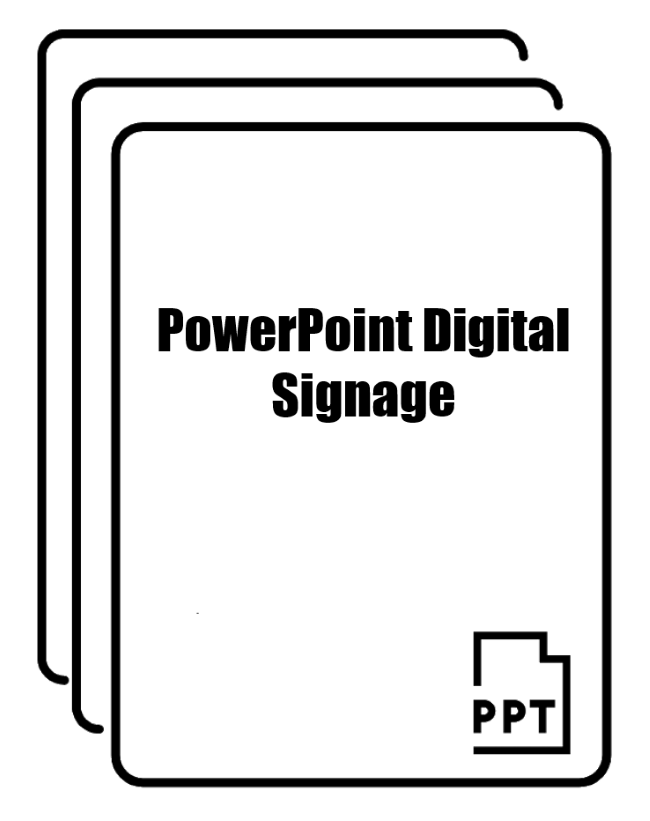

<p align="center">

</p>

# Overview

# Usage

# Building Executable
- Must create executable on Windows
- Requires Python and PyInstaller (https://pyinstaller.readthedocs.io/en/stable/index.html) 
- Command: ```pyinstaller  DigitalSignage.py --onefile```
- The output exe created will appear in the ```dist``` folder

# Change Log
- 2019-12-19 | Version 1.0
  - Initial Release